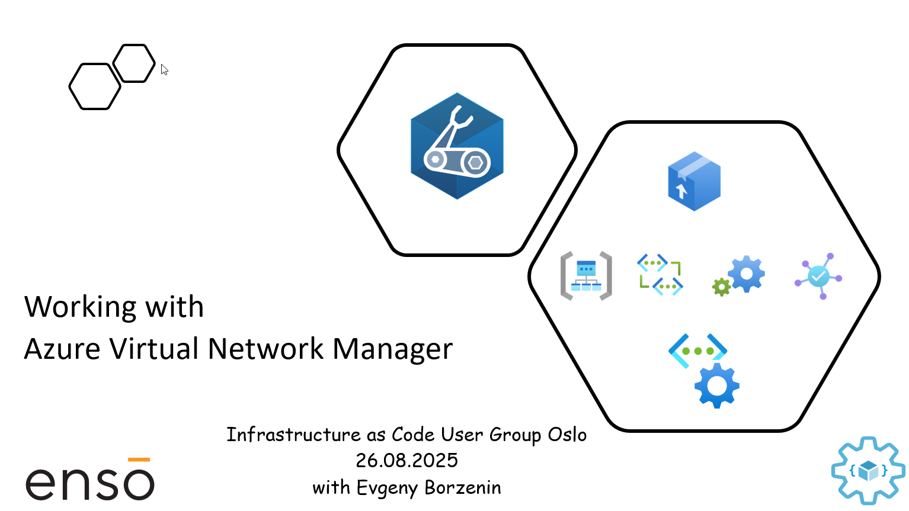

# Working with Azure Virtual Network Manager - Workshop

This is level 100 workshop that covers different aspects of working with Azure Virtual Network Manager (AVNM) where you will learn what AVNM is and:

- How to segment your virtual networks with Network Groups
- How to manage the IP addresses of your virtual networks using AVNM IPAM.
- How to implement hub-and-spoke and mesh network topology with AVNM
- How to secure your virtual networks using AVNM rule-set
- How to route spoke-to-spoke traffic via Azure Firewall

and much more...

Workshop is organized as a combination of theoretical blocks with slides and hand-on labs. Estimated time for workshop completion is 3 hours.

## Agenda

- Welcome + practical information
- Azure Virtual Network Manager overview (slides)
- [Lab-01](labs/lab-01/index.md) - Provision lab resources
- [Lab-02](labs/lab-02/index.md) - Managing Virtual Networks IP addresses using AVNM IPAM
- [Lab-03](labs/lab-03/index.md) - Segmenting virtual networks with Network Groups
- [Lab-04](labs/lab-04/index.md) - Implementing hub-and-spoke network topology with AVNM
- [Lab-05](labs/lab-05/index.md) - Secure virtual networks using AVNM rule-set
- [Lab-06](labs/lab-06/index.md) - Routing spoke-to-spoke and spoke-to-internet traffic via Azure Firewall
- [Lab-07](labs/lab-07/index.md) - Cleaning up resources

## Prerequisites

Please spend some time before the workshop and make sure that you have installed/registered/configured all [prerequisites](./prerequisites.md).