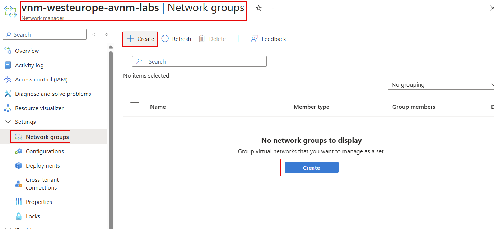
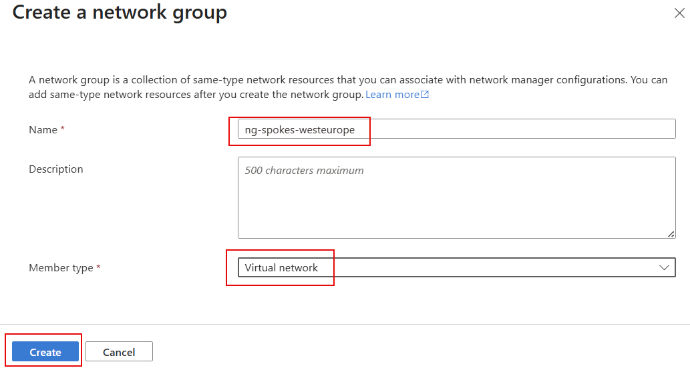
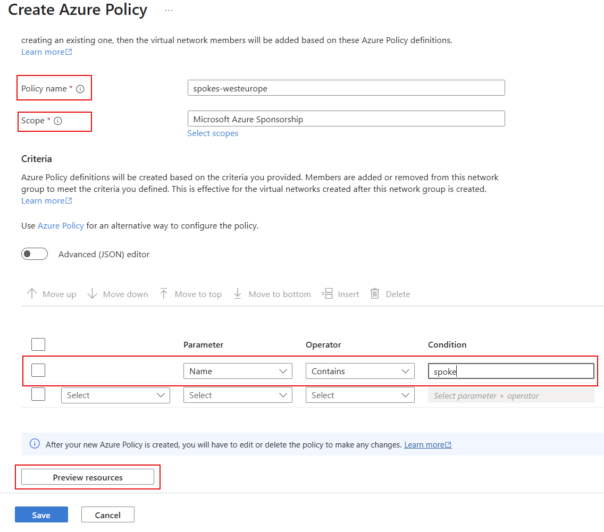
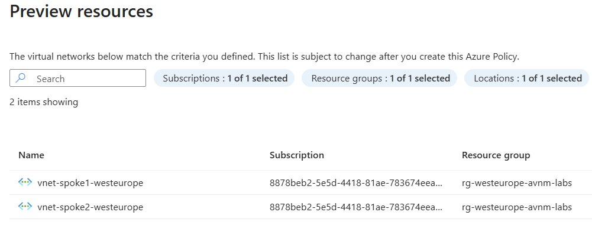
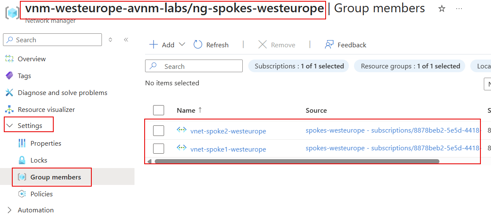

# lab-03 - Segmenting virtual networks with Network Groups

Before you start configuring connectivity, security and routing across your networks, you first need to group virtual networks into Network Groups.

A network group is global container that includes a set of virtual network resources from any region. Group membership is a many-to-many relationship, such that one group holds many virtual networks and any given virtual network can participate in multiple network groups. There are two types of memberships: static and dynamic memberships.

In this lab we will create two Network Groups: 
- `ng-spokes` - this group will be dynamic group containing all existing and future spokes Virtual Networks
- `ng-online` - this group will be static group containing online Virtual Network

## Task #1 - create dynamic Network Group `ng-spokes` for spokes VNets using Azure portal

For dynamic group, we will use convention that all Virtual Networks with name containing `spoke` will be automatically added to this group.

Navigate to `Network Groups` section in the Azure portal and click on `Create` to create a new Network Group.



Fill in the following information:

| Field | Value |
|-------|-------|
| Name  | ng-spokes |
| Description  | All Spoke VNets  |
| Member type | Select Virtual Network |



Click `Create` and wait for the deployment to complete. When complete, open `ng-spokes` group and navigate to `Group members` page and click `Create Azure Policy`.


Fill in the following information:

| Field | Value |
|-------|-------|
| Policy Name  | ng-spokes |
| Scope  | Select scope (Subscription(s), Management Group or Resource group) at which policy rules will be evaluated against |

At the `Criteria` section fill in policy rule criteria

| Field | Value |
|-------|-------|
| Parameter  | Select `Name` |
| Operator  | Select `Contains` |
| Condition  | Enter `spoke` |



Click `Preview resources` to see the resources that will be included in the group. You should see the following VNets in the list.



Click `Save`.

It may take some minutes for the policy to be applied and for the group to be populated with the existing VNets. While we are waiting, you can check that new Policy Definition 


and Policy assignments were created successfully.


Now, go back to `vnm-norwayeast-avnm-labs/ng-spokes` Network group nd check ``Group members` page. You should see that the group is populated with existing spoke VNets.




## Task #2 - create new spoke VNet and check that it was added into the Network Group

Let's create new `vnet-spoke4-norwayeast` Virtual Network using `az cli`. We will use existing IPAM for address reservation.

```powershell
# Get iac-main IP pool resource Id
$ipamPoolId = (az network manager ipam-pool show -n iac-main --network-manager-name vnm-norwayeast-avnm-labs -g rg-norwayeast-avnm-labs --query id -o tsv)

# Create new spoke VNet with IP range from iac-main IP pool
az network vnet create -n vnet-spoke4-norwayeast --resource-group rg-norwayeast-avnm-labs --ipam-allocations [0].number-of-ip-addresses=100 [0].id=$ipamPoolId 
```

Note! It may take some minutes for policy to take effect.

Navigate to `vnm-norwayeast-avnm-labs/ng-spokes` Network Group in a few minutes and check `Group members` page. You should see new VNet added to the group by the Policy.

## Task #3 - create new static Network Group for online VNets using Bicep

In this task we will create a new static Network Group called `ng-online` for all online Virtual Networks.


Create new file `online-ng.bicep` with the following content:

```bicep
resource networkManager 'Microsoft.Network/networkManagers@2024-07-01' existing = {
  name: 'vnm-norwayeast-avnm-labs'
}

resource onlineNetworkGroup 'Microsoft.Network/networkManagers/networkGroups@2024-07-01' = {
  parent: networkManager
  name: 'ng-online'
  properties: {
    description: 'Virtual Networks for Online workloads'
    memberType: 'VirtualNetwork'
  }
}

resource onlineVNet 'Microsoft.Network/virtualNetworks@2024-07-01' existing = {
  name: 'vnet-online1-norwayeast'
}


resource onlineVNetMember 'Microsoft.Network/networkManagers/networkGroups/staticMembers@2024-07-01' = {
  name: 'static-vnet-online1-norwayeast'
  parent: onlineNetworkGroup
  properties: {
    resourceId: onlineVNet.id
  }
}
```

Deploy it

```powershell
# Make sure that you are at the folder where task6.bicep file is located
pwd

# Deploy task6.bicep file
az deployment group create --resource-group rg-norwayeast-avnm-labs --template-file online-ng.bicep

# Check member list of ng-online Network Group
az network manager group static-member list --network-group ng-online --network-manager vnm-norwayeast-avnm-labs -g rg-norwayeast-avnm-labs --query [].name -o tsv
```