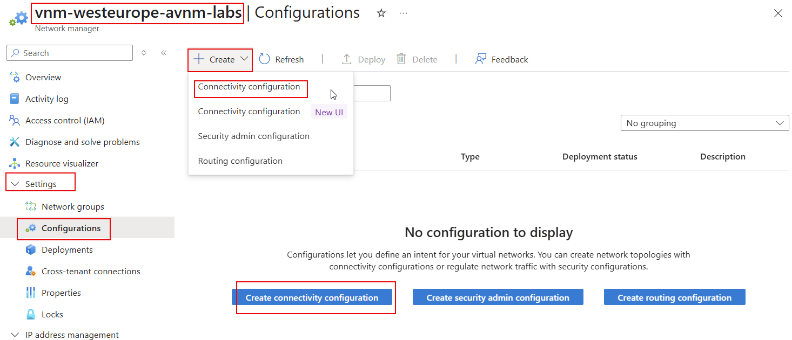
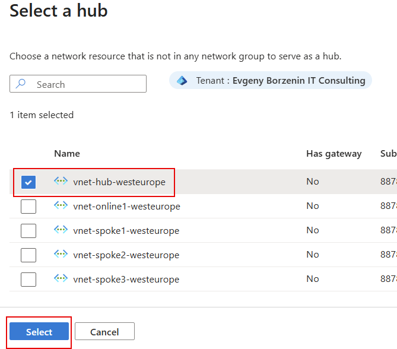
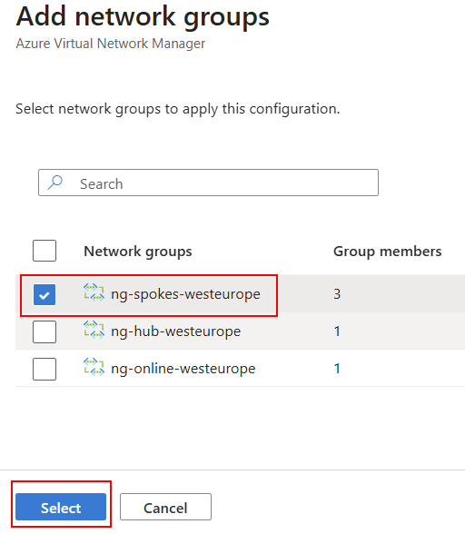
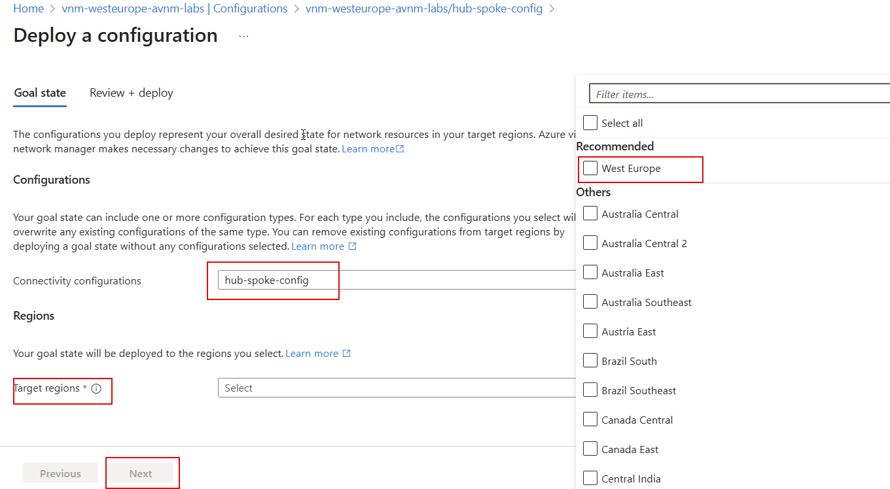
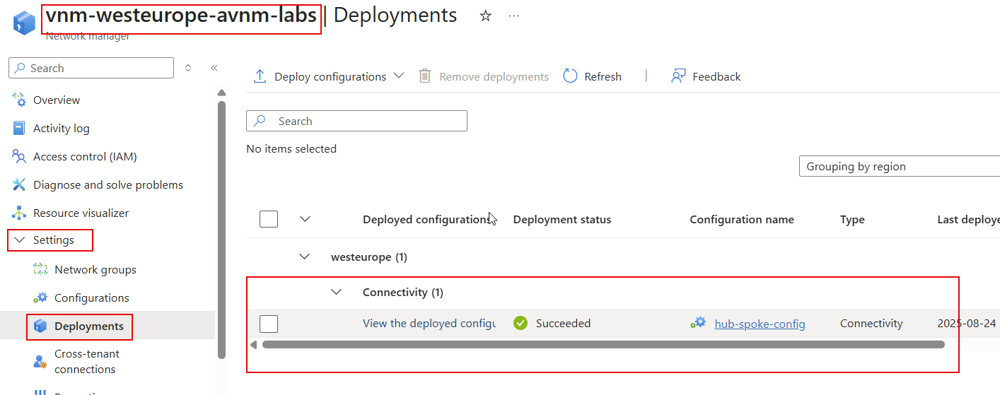
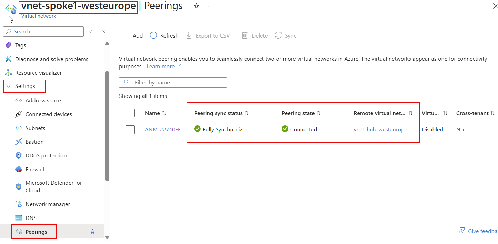
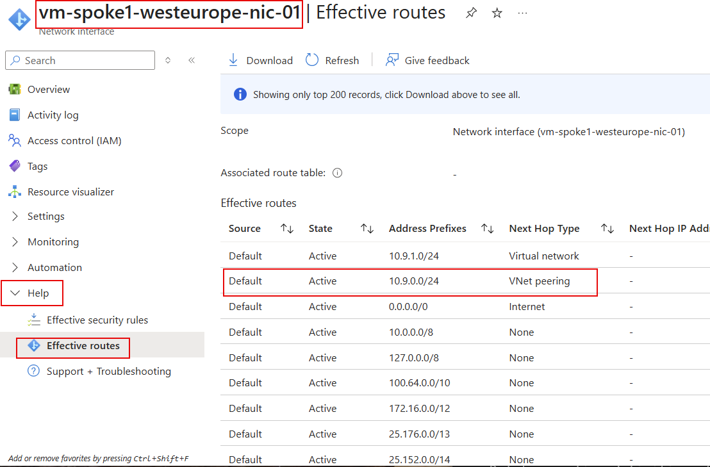
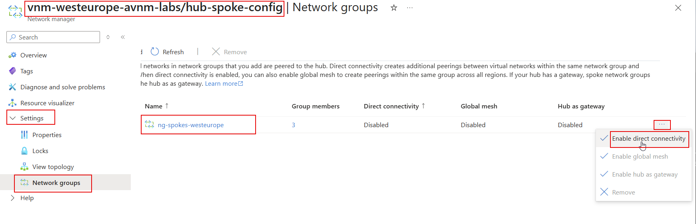
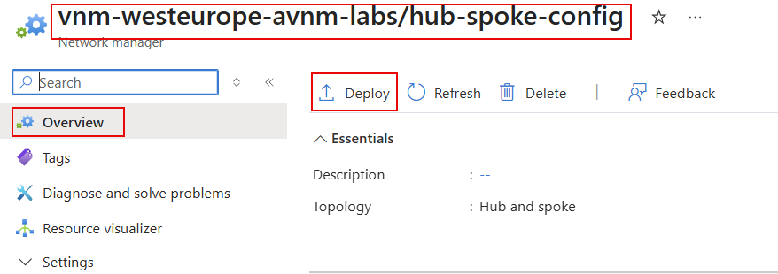
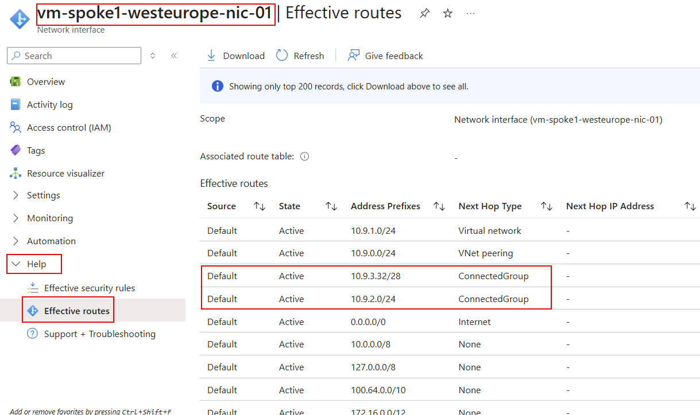

# lab-04 - Implementing hub-and-spoke network topology with AVNM

In this lab, we will implement a `Hub and Spoke` network topology using Azure Virtual Network Manager (AVNM). We will create a connectivity configuration that will establish connectivity between the hub and spoke virtual networks. We will also enable direct connectivity between spokes using AVNM `Direct connectivity` feature.

## Task #1 - create new `Hub and spoke` Connectivity configuration using Portal

To get a better understanding of what is Connectivity Configuration, let's create one using Azure portal.

Navigate to `vnm-westeurope-avnm-labs | Settings | Configurations` and click `Create Connectivity Configuration` (or select `+ Create | Connectivity Configuration`).



Fill in the following information at the `Basics` page:

| Field | Value |
|-------|-------|
| Name  | hub-spoke-config |
| Description  | Hub and Spoke Connectivity Configuration |

Click `Next Topology` and fill in the following information at the `Topology` page:

| Field | Value |
|-------|-------|
| Topology | Select `Hub and Spoke` |
| Spoke VNets | Select the Spoke virtual networks |


Click `Select a hub` and choose `vnet-hub-westeurope` Virtual Network.



At the `Spoke network groups` section, click `+ Add`, select `Add Network Groups` and choose `ng-spokes-westeurope` Network Group.



Leave `Enable connectivity within network group` option under `Direct connectivity` unchecked.


Click `Review and Create` and `Create`.


## Task #2 - Deploy Connectivity Configuration

Configuration that we created will not take effect until it is deployed. To deploy the configuration, follow these steps:

Navigate to `vnm-westeurope-avnm-labs | Settings | Configurations`, open `hub-spoke-config` Connectivity configuration and click `Deploy`.


Select `West Europe` as a `Target regions` and then click `Next`.



Review changes that will be deployed and click `Deploy`.


You can always find all deployments under `vnm-westeurope-avnm-labs | Settings | Deployments`.




After deployment is complete, there should be peering created between the hub and spoke virtual networks.

If you check `vnet-spoke1-westeurope`, you should see a peering connection to `vnet-hub-westeurope`.



If you check `Effective routes` for `vm-spoke1-westeurope-nic-01`, you should see the following new route to `vnet-hub-westeurope`.




## Task #3 - Test connectivity between VMs

Connect to `vm-spoke1-westeurope` using `az cli` Bastion and ssh extensions. Use `iac-admin` `fooBar123!` as a username and password to login. 


```bash
# Get vm-spoke1-westeurope resource id
$vmId = (az vm show --name vm-spoke1-westeurope --resource-group rg-westeurope-avnm-labs --query id --output tsv)

# SSH to vm-spoke1-westeurope via bastion host
az network bastion ssh --name bastion-westeurope --resource-group rg-westeurope-avnm-labs --target-resource-id $vmId --auth-type password --username iac-admin
```

From the terminal session, try to ping VMs from hub and spoke2. 

> Note! IP assined to your VMs might be different, so check them before you run the commands.


```bash
# ping hub VM
iac-admin@vm-spoke1-westeurope:~$ ping 10.9.0.132
PING 10.9.0.132 (10.9.0.132) 56(84) bytes of data.
64 bytes from 10.9.0.132: icmp_seq=1 ttl=64 time=3.05 ms
64 bytes from 10.9.0.132: icmp_seq=2 ttl=64 time=1.69 ms
64 bytes from 10.9.0.132: icmp_seq=3 ttl=64 time=1.31 ms
```

You should get a response from hub VM. Now, try to ping `vm-spoke2-westeurope`.

```bash
# ping VM at vnet-spoke2-westeurope VNet (you may have different IP for your VM)
iac-admin@vm-spoke1-westeurope:~$ ping 10.9.2.4
PING 10.9.2.4 (10.9.2.4) 56(84) bytes of data.
```

You will not get any response, because there are no connectivity between spokes. Let's enable direct connectivity between spokes using Virtual Network Manager `Direct connectivity` feature.

## Task #4 - Enable direct connectivity between VNets within Network Group

Open `hub-spoke-config` Connectivity Configuration and navigate to `Settings -> Network groups`. Select `ng-spokes-westeurope` Network Group, click `... -> Enable direct connectivity`.



When enabled, deploy configuration changes.



Select `hub-spoke-config` configuration, `West Europe` as a deployment region and Deploy.


When deployment complete, check `Effective routes` for `vm-spoke1-westeurope-nic-01`.

Note, it might take some minutes for changes to be applied. So if you don't see new routes, wait a couple of minutes and try again.  



You should now see new routes towards spoke VNets with `ConnectedGroup` as a `Next Hop Type`.

If you now go back to the `vm-spoke1-westeurope` terminal and try to ping `vm-spoke2-westeurope`, you should get a response.

```bash
iac-admin@vm-spoke1-westeurope:~$ ping 10.9.2.4
PING 10.9.2.4 (10.9.2.4) 56(84) bytes of data.
64 bytes from 10.9.2.4: icmp_seq=1 ttl=64 time=2.67 ms
64 bytes from 10.9.2.4: icmp_seq=2 ttl=64 time=1.06 ms
64 bytes from 10.9.2.4: icmp_seq=3 ttl=64 time=0.814 ms
64 bytes from 10.9.2.4: icmp_seq=4 ttl=64 time=1.08 ms
```
