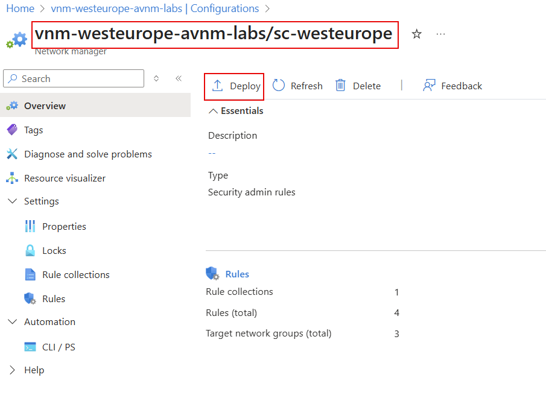
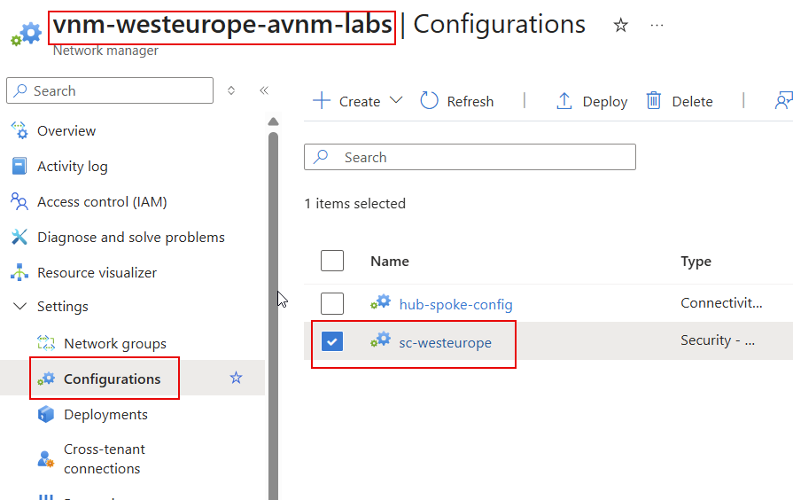
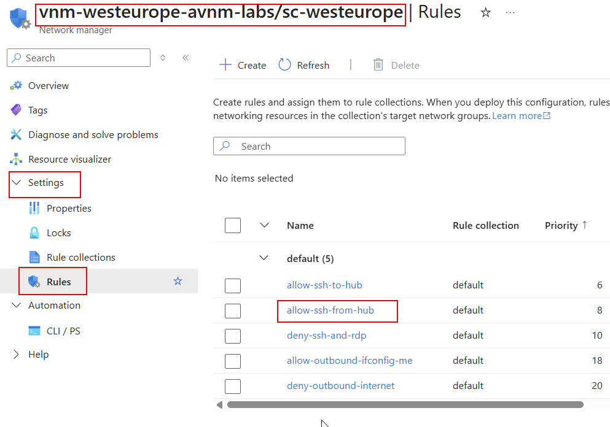
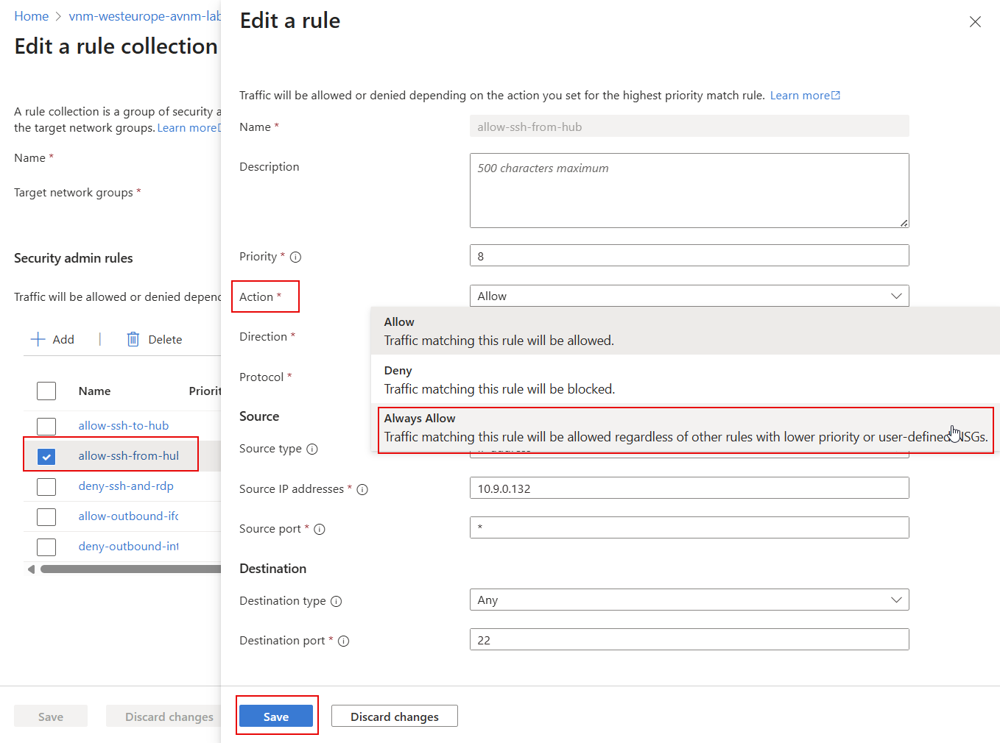

# lab-05 - Secure virtual networks using AVNM rule-set


## Task #1 - Create new Security Configuration using `Bicep`

In this task we will implement security rules to fullfil the following "business requirements":

- SSH sessions to spokes VMs only allowed from hub VM
- RDP traffic is now allowed
- Any traffic to Internet is denied, except for http and https to `ifconfig.me` 

This business requirement will be implemented using the following Admin Security Rules:

- deny SSH and RDP to all VNets
- allow SSH from hub VM (`10.9.0.132`) to spokes VMs
- deny Internet access for all VNets
- allow http and https to `ifconfig.me (34.160.111.145)` from hub VM

Before we implement these rules, let's check that:
- it's possible to SSH (via Bastion) to `vm-hub-westeurope`
- it's possible to SSH (via Bastion) to `vm-spoke1-westeurope`
- you can `curl ifconfig.me` and `curl google.com` from `vm-hub-westeurope` 

First, let's SSH into the hub VM:
```powershell
# Get hub VM resource ID
$vmId = (az vm show --name vm-hub-westeurope --resource-group rg-westeurope-avnm-labs --query id --output tsv)

az network bastion ssh --name bastion-westeurope --resource-group rg-westeurope-avnm-labs --target-resource-id $vmId --auth-type password --username iac-admin

# Test curl commands
curl ifconfig.me
curl google.com

# logout from VM
exit
```

Now, let's SSH into the spoke1 VM:
```powershell
# Get vm-spoke1-westeurope VM resource ID
$vmId = (az vm show --name vm-spoke1-westeurope --resource-group rg-westeurope-avnm-labs --query id --output tsv)

az network bastion ssh --name bastion-westeurope --resource-group rg-westeurope-avnm-labs --target-resource-id $vmId --auth-type password --username iac-admin

# Test curl commands
curl ifconfig.me
curl google.com
```

At this moment everything is wide opened. 
Now, let's implement security rules using Bicep. Create new `sc-westeurope.bicep` file with the following content:

```bicep
resource networkManager 'Microsoft.Network/networkManagers@2024-07-01' existing = {
  name: 'vnm-westeurope-avnm-labs'
}

resource securityAdminConfiguration 'Microsoft.Network/networkManagers/securityAdminConfigurations@2024-07-01' = {
  parent: networkManager
  name: 'sc-westeurope'
  properties: {
    applyOnNetworkIntentPolicyBasedServices: []
    networkGroupAddressSpaceAggregationOption: 'None'
  }
}

resource ng_hub_westeurope 'Microsoft.Network/networkManagers/networkGroups@2024-07-01' existing = {
  parent: networkManager
  name: 'ng-hub-westeurope'
}

resource ng_online_westeurope 'Microsoft.Network/networkManagers/networkGroups@2024-07-01' existing = {
  parent: networkManager
  name: 'ng-online-westeurope'
}

resource ng_spokes_westeurope 'Microsoft.Network/networkManagers/networkGroups@2024-07-01' existing = {
  parent: networkManager
  name: 'ng-spokes-westeurope'
}

resource ruleCollection 'Microsoft.Network/networkManagers/securityAdminConfigurations/ruleCollections@2024-07-01' = {
  parent: securityAdminConfiguration
  name: 'default'
  properties: {
    appliesToGroups: [
      {
        networkGroupId: ng_hub_westeurope.id
      }
      {
        networkGroupId: ng_online_westeurope.id
      }
      {
        networkGroupId: ng_spokes_westeurope.id
      }
    ]
  }  
}

resource allow_outbound_ifconfig_me 'Microsoft.Network/networkManagers/securityAdminConfigurations/ruleCollections/rules@2024-07-01' = {
  parent: ruleCollection
  name: 'allow-outbound-ifconfig-me'
  kind: 'Custom'
  properties: {
    priority: 18
    direction: 'Outbound'
    access: 'Allow'
    sources: [
      {
        addressPrefix: '*'
        addressPrefixType: 'IPPrefix'
      }
    ]
    destinations: [
      {
        addressPrefix: '34.160.111.145'
        addressPrefixType: 'IPPrefix'
      }
    ]
    destinationPortRanges: [
      '80'
      '443'
    ]
    protocol: 'Tcp'
  }
}

resource allow_ssh_from_hub 'Microsoft.Network/networkManagers/securityAdminConfigurations/ruleCollections/rules@2024-07-01' = {
  parent: ruleCollection
  name: 'allow-ssh-from-hub'
  kind: 'Custom'
  properties: {
    priority: 8
    direction: 'Inbound'
    access: 'Allow'
    sources: [
      {
        addressPrefix: '10.9.0.132'
        addressPrefixType: 'IPPrefix'
      }
    ]
    destinations: [
      {
        addressPrefix: '*'
        addressPrefixType: 'IPPrefix'
      }
    ]
    destinationPortRanges: [
      '22'
    ]
    protocol: 'Tcp'
  }
}

resource allow_ssh_to_hub 'Microsoft.Network/networkManagers/securityAdminConfigurations/ruleCollections/rules@2024-07-01' = {
  parent: ruleCollection
  name: 'allow-ssh-to-hub'
  kind: 'Custom'
  properties: {
    priority: 6
    direction: 'Inbound'
    access: 'Allow'
    sources: [
      {
        addressPrefix: '*'
        addressPrefixType: 'IPPrefix'
      }
    ]
    destinations: [
      {
        addressPrefix: '10.9.0.132'
        addressPrefixType: 'IPPrefix'
      }
    ]
    destinationPortRanges: [
      '22'
    ]
    protocol: 'Tcp'
  }
}

resource deny_outbound_internet 'Microsoft.Network/networkManagers/securityAdminConfigurations/ruleCollections/rules@2024-07-01' = {
  parent: ruleCollection
  name: 'deny-outbound-internet'
  kind: 'Custom'
  properties: {
    priority: 20
    direction: 'Outbound'
    access: 'Deny'
    sources: [
      {
        addressPrefix: '*'
        addressPrefixType: 'IPPrefix'
      }
    ]
    destinations: [
      {
        addressPrefix: 'Internet'
        addressPrefixType: 'ServiceTag'
      }
    ]
    destinationPortRanges: [
      '80'
      '443'
    ]
    protocol: 'Tcp'
  }
}
resource deny_ssh_and_rdp 'Microsoft.Network/networkManagers/securityAdminConfigurations/ruleCollections/rules@2024-07-01' = {
  parent: ruleCollection
  name: 'deny-ssh-and-rdp'
  kind: 'Custom'
  properties: {
    priority: 10
    direction: 'Inbound'
    access: 'Deny'
    sources: [
      {
        addressPrefix: '*'
        addressPrefixType: 'IPPrefix'
      }
    ]
    destinations: [
      {
        addressPrefix: '*'
        addressPrefixType: 'IPPrefix'
      }
    ]
    destinationPortRanges: [
      '22'
      '3389'
    ]
    protocol: 'Tcp'
  }
}

```

Deploy Security Configuration

```powershell
# Make sure that you are at the folder where task6.bicep file is located
pwd

# Deploy sc-westeurope.bicep file
az deployment group create --resource-group rg-westeurope-avnm-labs --template-file sc-westeurope.bicep
```

Next, deploy `sc-westeurope` Security configuration using Virtual Network Manager. Navigate to `vnm-westeurope-avnm-labs | Settings | Configurations`, select the `sc-westeurope` Security Configuration, and then click `Deploy`.

. 

Select `West Europe` as the target region and Deploy. 

After deployment is complete, let's verify if security rules fulfilled our requirements.

Try to connect to `vm-spoke1-westeurope` VM.
```powershell
# Get vm-spoke1-westeurope VM resource ID
$vmId = (az vm show --name vm-spoke1-westeurope --resource-group rg-westeurope-avnm-labs --query id --output tsv)

az network bastion ssh --name bastion-westeurope --resource-group rg-westeurope-avnm-labs --target-resource-id $vmId --auth-type password --username iac-admin
```

This time, you will not be able to SSH into this VM, because `deny-ssh-and-rdp` rule blocks any ssh and rdp traffic.

Try to SSH into hub VM.

```powershell   
# Get vm-hub-westeurope VM resource ID
$vmId = (az vm show --name vm-hub-westeurope --resource-group rg-westeurope-avnm-labs --query id --output tsv)

az network bastion ssh --name bastion-westeurope --resource-group rg-westeurope-avnm-labs --target-resource-id $vmId --auth-type password --username iac-admin
```

You should now be able to SSH into the hub VM, because `allow-ssh-to-hub` allows it. Now, from within the hub VM session, try to SSH into the spoke1 VM.

```bash
ssh iac-admin@10.9.1.4
```

You should be able to SSH into the spoke1 VM because `allow-ssh-from-hub` rule allows it. 
Run `curl ifconfig.me` and `curl google.com` commands from hub VM.

You should get response from `curl ifconfig.me` command because `allow-outbound-ifconfig-me` rule allows it, and `curl google.com` should fail because `deny-outbound-internet` rule blocks it.

## Task #2 - Implement Always allow rule

When you define Admin security rule, there is one special type of action called `Always allow`. Official documentation describes it as follows:

> Regardless of other rules with lower priority or user-defined network security groups, allow traffic on the specified port, protocol, and source/destination IP prefixes in the specified direction.

In our current scenario we configured that SSH to spoke1 VM is allowed from hub VM. 

Now, let's imagine that imaginary team owning spoke1 VM decided to disable SSH to spoke1 VM by implementing deny Network Security Group (NSG) rule. 

Create `spoke1-workload-subnet-nsg.bicep` file with the following content.

```bicep
param hubVmIP string = '10.9.0.132'

resource nsg_workload_subnet_spoke1_westeurope 'Microsoft.Network/networkSecurityGroups@2024-07-01' = {
  name: 'nsg-workload-subnet-spoke1-westeurope'
  location: 'westeurope'
  properties: {
    securityRules: [
      {
        name: 'deny-ssh-from-hub-vm'
        type: 'Microsoft.Network/networkSecurityGroups/securityRules'
        properties: {
          protocol: 'TCP'
          sourcePortRange: '*'
          destinationPortRange: '22'
          sourceAddressPrefix: hubVmIP
          destinationAddressPrefix: '*'
          access: 'Deny'
          priority: 100
          direction: 'Inbound'
        }
      }
    ]
  }
}

```

Deploy `spoke1-workload-subnet-nsg.bicep` file.

```powershell
# Make sure that you are at the folder where spoke1-workload-subnet-nsg.bicep file is located
pwd

# Deploy spoke1-workload-subnet-nsg.bicep file
az deployment group create --resource-group rg-westeurope-avnm-labs --template-file spoke1-workload-subnet-nsg.bicep

# Assign nsg-workload-subnet-spoke1-westeurope to subnet-workload of vnet-spoke1-westeurope
az network vnet subnet update --name subnet-workload --resource-group rg-westeurope-avnm-labs --vnet-name vnet-spoke1-westeurope --network-security-group nsg-workload-subnet-spoke1-westeurope
```

It takes some minutes for NSG to take effect. Connect to hub VM and SSH to vm-spoke1-westeurope.

```powershell
# Get vm-hub-westeurope VM resource ID
$vmId = (az vm show --name vm-hub-westeurope --resource-group rg-westeurope-avnm-labs --query id --output tsv)

az network bastion ssh --name bastion-westeurope --resource-group rg-westeurope-avnm-labs --target-resource-id $vmId --auth-type password --username iac-admin
# From within hub VM session, try to SSH into the spoke1 VM.
ssh iac-admin@10.9.1.4
```

You can't ssh to `vm-spoke1-westeurope` because now TCP port 22 is blocked by the NSG rule. TO fix this, we should change action type for `allow-ssh-from-hub` Admin security rule to `Always allow`.

Let's do it from the portal. Navigate to `vnm-westeurope-avnm-labs | Settings | Configurations | sc-westeurope`.



Then `Settings | Rules | allow-ssh-from-hub` rule.



Change `allow-ssh-from-hub` rule action type to `Always allow`.



Save and Deploy changes.

. 

Select `West Europe` as the target region and Deploy. 

WHen deployed, get back to hub VM session and try to SSH to spoke1 VM again.

```powershell
# Get vm-hub-westeurope VM resource ID
$vmId = (az vm show --name vm-hub-westeurope --resource-group rg-westeurope-avnm-labs --query id --output tsv)

az network bastion ssh --name bastion-westeurope --resource-group rg-westeurope-avnm-labs --target-resource-id $vmId --auth-type password --username iac-admin
# From within hub VM session, try to SSH into the spoke1 VM.
ssh iac-admin@10.9.1.4
```

You should be able to SSH into `vm-spoke1-westeurope` successfully.
