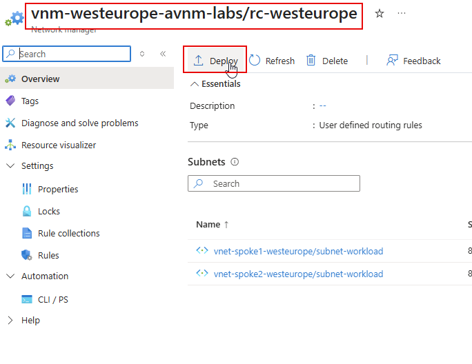
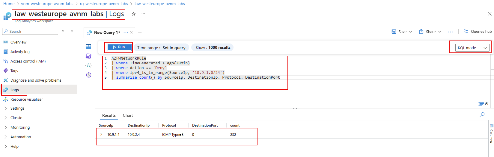
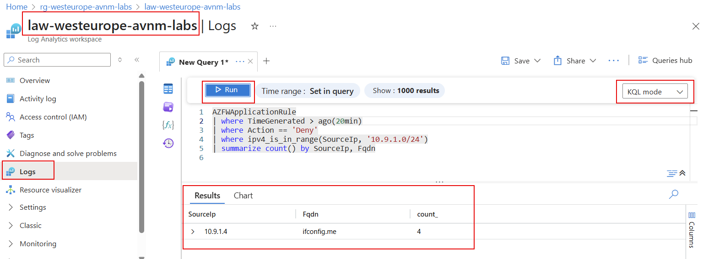

# lab-06 - Routing spoke-to-spoke and spoke-to-internet traffic via Azure Firewall

In this lab we will use Azure Virtual Network Manager to route traffic between spoke VNets and the internet via Azure Firewall. We already provisioned Azure Firewall in the hub VNet with no rules. 

Before we implement custom routing, let's review the current state of connectivity:

- it's possible to ssh into spoke1 and spoke2 VMs from hub VM
- it's possible to ping spoke2 VM from spoke1 VM and vise versa
- it's possible to access ifconfig.me site from both spoke1 and spoke2 VMs

Let's verify that.

```powershell
# Get vm-hub-westeurope VM resource ID
$vmId = (az vm show --name vm-hub-westeurope --resource-group rg-westeurope-avnm-labs --query id --output tsv)

az network bastion ssh --name bastion-westeurope --resource-group rg-westeurope-avnm-labs --target-resource-id $vmId --auth-type password --username iac-admin

# From hub VM, ssh to spoke1 vm
ssh iac-admin@10.9.1.4

# From spoke1 VM try to ping spoke2 VM
iac-admin@vm-spoke1-westeurope:~$ ping 10.9.2.4
PING 10.9.2.4 (10.9.2.4) 56(84) bytes of data.
64 bytes from 10.9.2.4: icmp_seq=1 ttl=64 time=1.44 ms
64 bytes from 10.9.2.4: icmp_seq=2 ttl=64 time=1.39 ms
64 bytes from 10.9.2.4: icmp_seq=3 ttl=64 time=1.05 ms

# logout from spoke1 VM
exit

# logout from hub VM
exit
```

To implement spoke-to-spoke and spoke-to-internet traffic routing via Azure Firewall, we will use `Routing configurations` feature of Azure Virtual Network Manager. 


## Task #1 - Create new Routing Configuration using `Bicep`

Create new bicep file `routing-configuration.bicep` with the following content:

```bicep
param azureFirewallPrivateIp string = '10.9.0.4'
param spoke2VNetIPRange string = '10.9.2.0/24'
param spoke1VNetIPRange string = '10.9.1.0/24'

resource networkManager 'Microsoft.Network/networkManagers@2024-07-01' existing = {
  name: 'vnm-westeurope-avnm-labs'
}

resource routingConfiguration 'Microsoft.Network/networkManagers/routingConfigurations@2024-05-01' = {
  parent: networkManager
  name: 'rc-westeurope'
  properties: {
  }
}

resource ng_spokes_westeurope 'Microsoft.Network/networkManagers/networkGroups@2024-07-01' existing = {
  parent: networkManager
  name: 'ng-spokes-westeurope'
}

resource ruleCollection 'Microsoft.Network/networkManagers/routingConfigurations/ruleCollections@2024-05-01' = {
  parent: routingConfiguration
  name: 'spokes'
  properties: {
    appliesTo: [
      {
        networkGroupId: ng_spokes_westeurope.id
      }
    ]
    disableBgpRoutePropagation: 'True'
  }
}

resource internet 'Microsoft.Network/networkManagers/routingConfigurations/ruleCollections/rules@2024-05-01' = {
  parent: ruleCollection
  name: 'internet'
  properties: {
    destination: {
      type: 'AddressPrefix'
      destinationAddress: '0.0.0.0/0'
    }
    nextHop: {
      nextHopType: 'VirtualAppliance'
      nextHopAddress: azureFirewallPrivateIp
    }
  }
}

resource spoke2 'Microsoft.Network/networkManagers/routingConfigurations/ruleCollections/rules@2024-05-01' = {
  parent: ruleCollection
  name: 'spoke2'
  properties: {
    destination: {
      type: 'AddressPrefix'
      destinationAddress: spoke2VNetIPRange
    }
    nextHop: {
      nextHopType: 'VirtualAppliance'
      nextHopAddress: azureFirewallPrivateIp
    }
  }
}

resource spoke1 'Microsoft.Network/networkManagers/routingConfigurations/ruleCollections/rules@2024-05-01' = {
  parent: ruleCollection
  name: 'spoke1'
  properties: {
    destination: {
      type: 'AddressPrefix'
      destinationAddress: spoke1VNetIPRange
    }
    nextHop: {
      nextHopType: 'VirtualAppliance'
      nextHopAddress: azureFirewallPrivateIp
    }
  }
}
```

Deploy `routing-configuration.bicep` file

```powershell
# Make sure that you are at the folder where routing-configuration.bicep file is located
pwd

# Deploy routing-configuration.bicep file
az deployment group create --resource-group rg-westeurope-avnm-labs --template-file routing-configuration.bicep
```

When provisioned, deploy it from Azure Virtual Network Manager, the same way we deployed Connectivity and Security configurations.

. 

When deployed, try to ping `spoke2` VM from `spoke1` VM.

```powershell
# Get vm-hub-westeurope VM resource ID
$vmId = (az vm show --name vm-hub-westeurope --resource-group rg-westeurope-avnm-labs --query id --output tsv)

az network bastion ssh --name bastion-westeurope --resource-group rg-westeurope-avnm-labs --target-resource-id $vmId --auth-type password --username iac-admin

# From hub VM, ssh to spoke1 vm
ssh iac-admin@10.9.1.4

# From spoke1 VM try to ping spoke2 VM
iac-admin@vm-spoke1-westeurope:~$ ping 10.9.2.4
PING 10.9.2.4 (10.9.2.4) 56(84) bytes of data.

# logout from spoke1 VM
exit

# logout from hub VM
exit
```

Ping is not responding, because now traffic between spoke VMs is being routed through the Azure Firewall. By default, the Azure Firewall denies all traffic that is not explicitly allowed. Let's check Azure Firewall logs. 

Initial IaC deployment script configured that all Azure Firewall Diagnostic logs are sent to Resource specific tables of `law-westeurope-avnm-labs` Log Analytics workspace (LAW). Let's check Network rules logs. 

Navigate to `Azure Portal > Log Analytics workspaces > law-westeurope-avnm-labs > Logs` and run the following query. Make sure that you are in `KQL mode`

```kql
AZFWNetworkRule
| where TimeGenerated > ago(20min)
| where Action == 'Deny'
| where ipv4_is_in_range(SourceIp, '10.9.1.0/24')
| summarize count() by SourceIp, DestinationIp, Protocol, DestinationPort
```



The query above queries data from `AZFWNetworkRule` table. It retrieves all deny requests initiated from `spoke1` VNet IP range (where ipv4_is_in_range(SourceIp, '10.9.1.0/24')) for the last 20 min, then it groups the results by SourceIp, DestinationIp, Protocol, and DestinationPort.

It shows that all `ICMP` requests (aka ping) are blocked from `10.9.1.4` (spoke1 VM) to `10.9.2.4` (spoke2 VM).

## Task #2 - Create Network Firewall Rule to allow ping between spokes

To fix the issue, we need to create new Firewall Network rule to allow `ICMP` traffic between `10.9.1.0/24` and `10.9.2.0/24` spoke VNets.

Create new `firewall-rules.bicep` file with the following content:

```bicep
param spoke1IPRange string = '10.9.1.0/24'
param spoke2IPRange string = '10.9.2.0/24'


resource firewallPolicies 'Microsoft.Network/firewallPolicies@2024-07-01' existing = {
  name: 'nfp-westeurope'
}

resource spokesRuleCollectionGroup 'Microsoft.Network/firewallPolicies/ruleCollectionGroups@2023-05-01' = {
  parent: firewallPolicies
  name: 'SpokesFirewallRuleCollectionGroup'
  properties: {
    priority: 200
    ruleCollections: [
      {
        name: 'spokes-net-rc01'
        ruleCollectionType: 'FirewallPolicyFilterRuleCollection'
        priority: 100
        action: {
          type: 'Allow'
        }
        rules: [
        {
            name: 'allow-ping-between-spokes'
            ruleType: 'NetworkRule'
            description: 'Allow ICMP between spoke VNets'
            sourceAddresses: [
              spoke1IPRange
              spoke2IPRange
            ]
            ipProtocols: [
              'ICMP'
            ]
            destinationPorts: [
              '*'
            ]
            destinationAddresses: [
              spoke1IPRange
              spoke2IPRange
            ]
          }          
        ]
      }                
    ]
  }
}

```

Deploy the `firewall-rules.bicep` file.

```powershell
# Make sure that you are at the folder where firewall-rules.bicep file is located
pwd

# Deploy firewall-rules.bicep file
az deployment group create --resource-group rg-westeurope-avnm-labs --template-file firewall-rules.bicep
```

When deployed, get back to your SSH session and try to ping `10.9.2.4` from spoke1 VM. TThis time, ping should succeed.

```bash
iac-admin@vm-spoke1-westeurope:~$ ping 10.9.2.4
PING 10.9.2.4 (10.9.2.4) 56(84) bytes of data.
64 bytes from 10.9.2.4: icmp_seq=86 ttl=63 time=4.52 ms
64 bytes from 10.9.2.4: icmp_seq=87 ttl=63 time=2.13 ms
64 bytes from 10.9.2.4: icmp_seq=88 ttl=63 time=2.48 ms
64 bytes from 10.9.2.4: icmp_seq=89 ttl=63 time=2.35 ms
```

## Task #3 - Create Application Firewall Rule to allow outbound traffic to ifconfig.me
One of the routes we configured was to send all outbound Internet traffic (`0.0.0.0/0`) via Azure firewall. 

Let's verify that. From spoke1 VM, try to run `curl ifconfig.me` command. 

```bash
iac-admin@vm-spoke1-westeurope:~$ curl ifconfig.me
Action: Deny. Reason: No rule matched. Proceeding with default action.
```

As you can see, it's blocked by the firewall. This is also confirmed by the logs. 

Navigate to `Azure Portal > Log Analytics workspaces > law-westeurope-avnm-labs > Logs` and run the following query. Make sure that you are in `KQL mode`

```kql
AZFWApplicationRule
| where TimeGenerated > ago(20min)
| where Action == 'Deny'
| where ipv4_is_in_range(SourceIp, '10.9.1.0/24')
| summarize count() by SourceIp, Fqdn
```




To solve this issue, we need to implement Firewall Application rule to allow `HTTP` and `HTTPS` traffic from spoke VNets to `ifconfig.me`. 

Update `firewall-rules.bicep` file with new Application rule:

```bicep
param spoke1IPRange string = '10.9.1.0/24'
param spoke2IPRange string = '10.9.2.0/24'


resource firewallPolicies 'Microsoft.Network/firewallPolicies@2024-07-01' existing = {
  name: 'nfp-westeurope'
}

resource spokesRuleCollectionGroup 'Microsoft.Network/firewallPolicies/ruleCollectionGroups@2023-05-01' = {
  parent: firewallPolicies
  name: 'SpokesFirewallRuleCollectionGroup'
  properties: {
    priority: 200
    ruleCollections: [
      {
        name: 'spokes-net-rc01'
        ruleCollectionType: 'FirewallPolicyFilterRuleCollection'
        priority: 100
        action: {
          type: 'Allow'
        }
        rules: [
        {
            name: 'allow-ping-between-spokes'
            ruleType: 'NetworkRule'
            description: 'Allow ICMP between spoke VNets'
            sourceAddresses: [
              spoke1IPRange
              spoke2IPRange
            ]
            ipProtocols: [
              'ICMP'
            ]
            destinationPorts: [
              '*'
            ]
            destinationAddresses: [
              spoke1IPRange
              spoke2IPRange
            ]
          }          
        ]
      }      
      {
        name: 'spokes-app-rc01'
        ruleCollectionType: 'FirewallPolicyFilterRuleCollection'
        priority: 200
        action: {
          type: 'Allow'
        }
        rules: [
          {
            name: 'allow-outbound-to-ifconfig-me'
            ruleType: 'ApplicationRule'
            description: 'Allow HTTP/HTTPS to ifconfig.me'
            sourceAddresses: [
              spoke1IPRange
              spoke2IPRange
            ]
            protocols: [
              {
                port: 80
                protocolType: 'Http'
              }
              {
                port: 443
                protocolType: 'Https'
              }
            ]
            targetFqdns: [
              'ifconfig.me'
            ]
          }
        ]
      }      
    ]
  }
}

```

Deploy `firewall-rules.bicep` Bicep file:

```powershell
# Make sure that you are at the folder where firewall-rules.bicep file is located
pwd

# Deploy firewall-rules.bicep file
az deployment group create --resource-group rg-westeurope-avnm-labs --template-file firewall-rules.bicep
```

When deployed, get back to your SSH session and try to run `curl ifconfig.me` command from spoke1 VM. This time it should succeed.

