# lab-07 - Managing Virtual Networks IP addresses using AVNM IPAM

Before we start working with IP Address Management, we need to create new Address Pool in our Virtual Network Manager. This Address Pool will be used to manage IP addresses of our virtual networks.

Some of the tasks require `virtual-network-manager` extension, so make sure that it's installed.

```powershell
# Install virtual-network-manager extension
az extension add -n virtual-network-manager
```

## Task #1 - create new Address Pool at Azure portal 

Note! If you don't like using the Azure portal, you can also create the IP Address Pool using Azure CLI. If that's the case, go to `Task #1.1`.

Navigate to the `vnm-norwayeast-avnm-labs` Virtual Network Manager and select the `IP address management->IP address pools` section. Click on `Create` to create a new Address Pool.
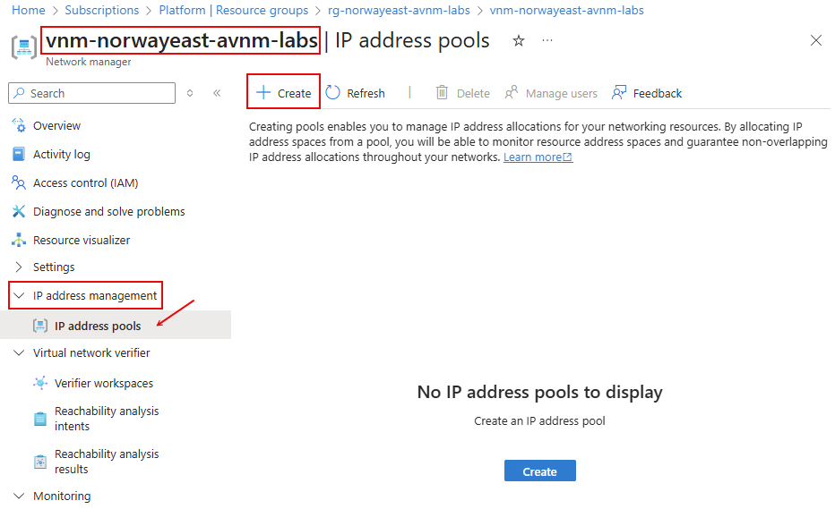

Fill in the following information:
| Field | Value |
|-------|-------|
| Name  | iac-main-pool |
| Display name | IAC Main Pool |
| Region | Norway East |
| Description | Main Address Pool for IAC labs |
| Parent pool | Keep empty |

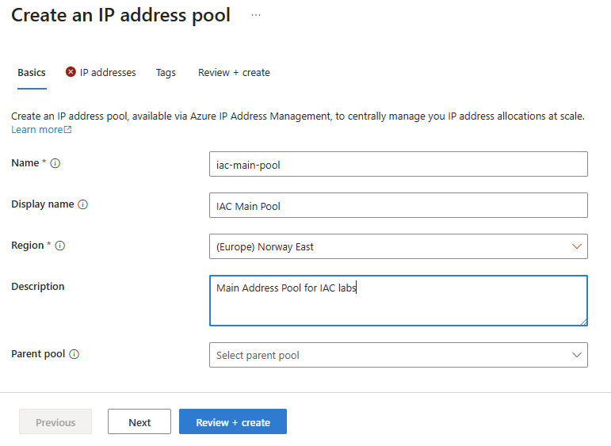

Click `Next` to go to `IP addresses` section.

At the `IP addresses` section, Fill in the following information:
| Field | Value |
|-------|-------|
| IP address type | IPv4 |
| Starting address | 10.9.0.0 |
| Size | /16 |


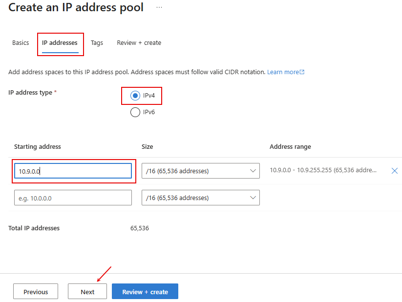

Click `Review + create` and then `Create` to create the Address Pool.

After pool is created you will see it in the list of Address Pools.
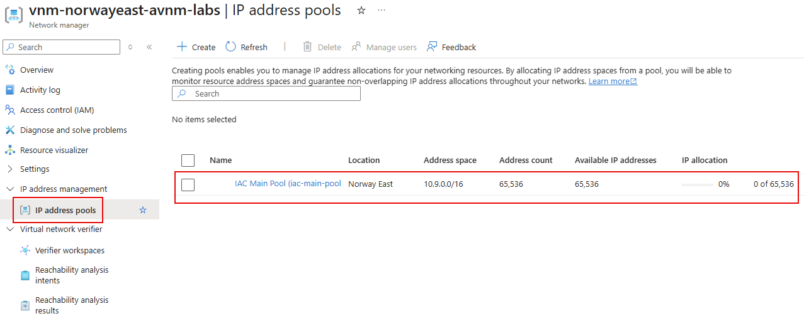

If you navigate to VNet overview page, you can now see that IP range is managed by the IPAM
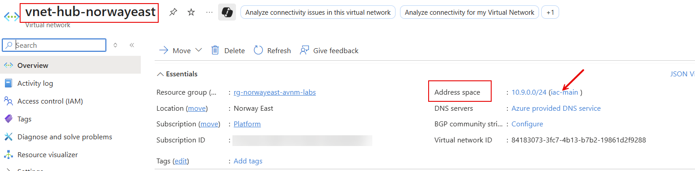

## Task #1.1 - create new Address Pool using `az cli`

Use the following command to create a new Address Pool using `az cli`

```powershell
az network manager ipam-pool create -n "iac-main" --network-manager-name "vnm-norwayeast-avnm-labs" --resource-group "rg-norwayeast-avnm-labs" --address-prefixes "['10.9.0.0/16']" --display-name "IaC Main Pool" --description "Main Address Pool for IAC labs"
```

After pool is created you will find it in the list of Address Pools.


## Task #2 - Associate existing `vnet-hub-norwayeast` VNet with Address Pool using Portal

To associate `vnet-hub-norwayeast` virtual network with the IP address pool, navigate to the `vnm-norwayeast-avnm-labs/iac-main-pool` address pool and select `Allocations` under `Settings` tab. Click on `Associate resources` to associate the virtual network with the address pool.

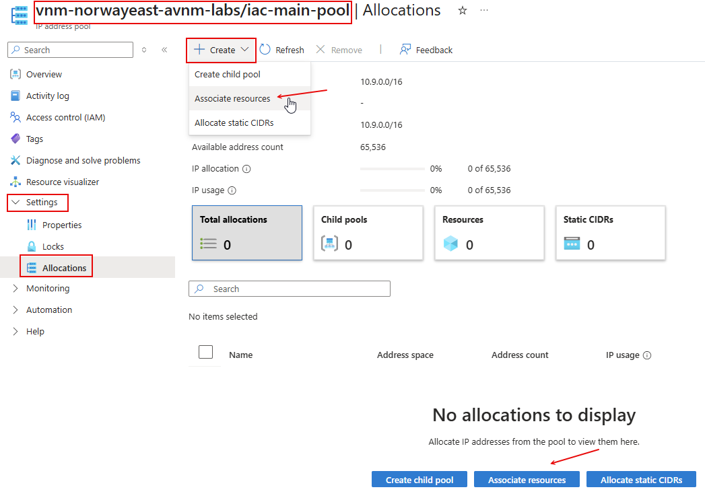

From the list of Virtual Networks, select `vnet-hub-norwayeast` and click `Associate`.
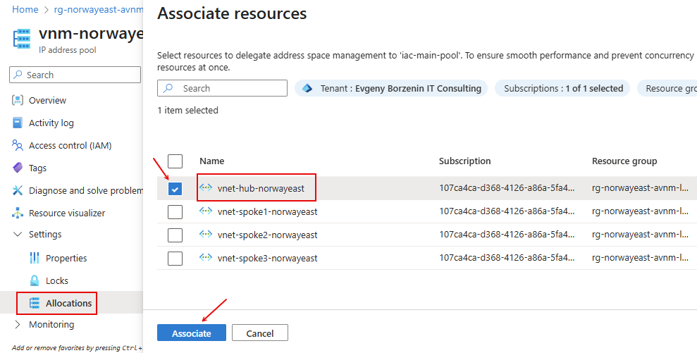

If everything is correct, you will see the `vnet-hub-norwayeast` virtual network, all its subnets, and `vm-hub-norwayeast-nic-01` NIC associated with `vm-hub-norwayeast` virtual machine in the list of associated resources.


## Task #3 - Associate `vnet-spoke1-norwayeast` VNet with Address Pool using Bicep

You can associate existing virtual network to the IP address pool if VNet address range is withing pool address range. In our case, IP address pool uses `10.9.0.0/16` range and `vnet-spoke1-norwayeast` uses `10.9.1.0/24` range, so if should work.

To associate existing virtual network with the IP address pool using Bicep template, create `task3.bicep` file with the following content:

```bicep
param parIndex int = 1
param parLocation string = 'norwayeast'

var varVNetName = 'vnet-spoke${parIndex}-${parLocation}'

resource ipamPool  'Microsoft.Network/networkManagers/ipamPools@2024-07-01' existing = {
  name: 'vnm-${parLocation}-avnm-labs/iac-main'
}

module modVNet 'br/public:avm/res/network/virtual-network:0.7.0' = {
  name: 'deploy-${varVNetName}-${parIndex}'
  params: {
    addressPrefixes: [
      ipamPool.id
    ]
    ipamPoolNumberOfIpAddresses: '256'
    name: varVNetName
    location: parLocation
    subnets: [
      {
        name: 'subnet-workload'
        ipamPoolPrefixAllocations: [
          {
            pool: {
              id: ipamPool.id
            }
            numberOfIpAddresses: '256'
          }
        ]
      }
    ]
    enableTelemetry: false
  }
}
```

Original Address Range that was assigned to this VNet was `/24` (256 IP addresses), so we should set `ipamPoolNumberOfIpAddresses` property to `256`.


Deploy template.

```powershell
# Make sure that you are at the folder where task3.bicep file is located
pwd

# Deploy task3.bicep file
az deployment group create -g rg-norwayeast-avnm-labs --template-file task3.bicep --parameters parIndex=1
```

## Task #4 - Associate `vnet-spoke2-norwayeast` VNet with Address Pool using `az cli`

To associate existing `vnet-spoke2-norwayeast` virtual network with the address pool using `az cli`, use the following command:

```powershell
# Get iac-main IP pool resource Id
$ipamPoolId = (az network manager ipam-pool show -n iac-main --network-manager-name vnm-norwayeast-avnm-labs -g rg-norwayeast-avnm-labs --query id -o tsv)
# Associate vnet-spoke2-norwayeast with iac-main IP pool
az network vnet update --name vnet-spoke2-norwayeast -g rg-norwayeast-avnm-labs --ipam-allocations [0].number-of-ip-addresses=256 [0].id=$ipamPoolId
```

Original Address Range that was assigned to this VNet was `/24` (256 IP addresses), so we should use this value when specifying `number-of-ip-addresses` parameter.

If you check `vnm-norwayeast-avnm-labs/iac-main | Allocations` at the Portal, you should see that the `vnet-spoke2-norwayeast` virtual network is now associated with the `iac-main` IP address pool, but `subnet-workload` and `vm-spoke2-norwayeast-nic-01` NIC are not associated yet. To fix it, you need to associate subnet `subnet-workload` with IP address pool.

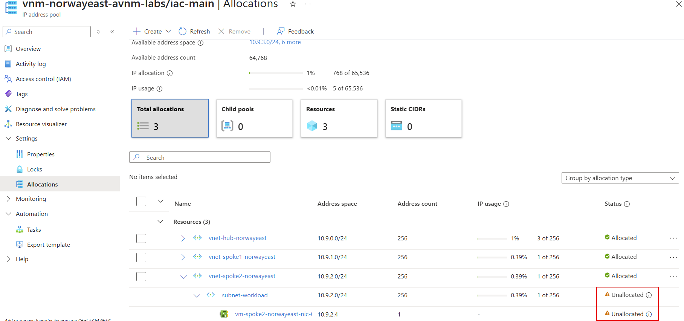

```powershell
# Get iac-main IP pool resource Id
$ipamPoolId = (az network manager ipam-pool show -n iac-main --network-manager-name vnm-norwayeast-avnm-labs -g rg-norwayeast-avnm-labs --query id -o tsv)

# Associate subnet-workload with iac-main IP pool
az network vnet subnet update -n subnet-workload --vnet-name vnet-spoke2-norwayeast -g rg-norwayeast-avnm-labs --ipam-allocations [0].number-of-ip-addresses=256 [0].id=$ipamPoolId
```

As with VNet, the original Address Range that was assigned to `subnet-workload` was `/24` (256 IP addresses), so we should use this value when specifying `number-of-ip-addresses` parameter.

Refresh  `vnm-norwayeast-avnm-labs/iac-main | Allocations` page and now everything should be allocated.
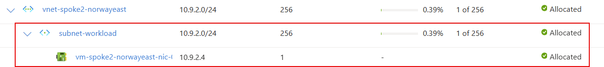


## Task #5 - Create new  `vnet-spoke4-norwayeast` VNet with IP range from `iac-main` pool using Bicep

Create new `task5.bicep` file with the following content:

```bicep
param parIndex int
param parLocation string = 'norwayeast'
param numberOfIpAddresses int = 30

var varVNetName = 'vnet-spoke${parIndex}-${parLocation}'

resource ipamPool  'Microsoft.Network/networkManagers/ipamPools@2024-07-01' existing = {
  name: 'vnm-${parLocation}-avnm-labs/iac-main'
}

module modVNet 'br/public:avm/res/network/virtual-network:0.7.0' = {
  name: 'deploy-${varVNetName}-${parIndex}'
  params: {
    addressPrefixes: [
      ipamPool.id
    ]
    ipamPoolNumberOfIpAddresses: '${numberOfIpAddresses}'
    name: varVNetName
    location: parLocation
    subnets: [
      {
        name: 'subnet-workload'
        ipamPoolPrefixAllocations: [
          {
            pool: {
              id: ipamPool.id
            }
            numberOfIpAddresses: '${numberOfIpAddresses}'
          }
        ]
      }
    ]
    enableTelemetry: false
  }
}
```

Deploy it using `az cli`

```powershell
# Make sure that you are at the folder where task5.bicep file is located
pwd

# Deploy task5.bicep file
az deployment group create -g rg-norwayeast-avnm-labs --template-file task5.bicep --parameters parIndex=4

```

Check `Allocations` page. You should see new `vnet-spoke4-norwayeast` VNet with `subnet-workload` associated with `iac-main` IP address pool.

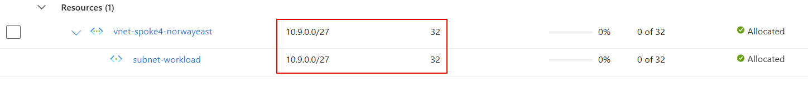

Note! We specified number of IP addresses we need 30 and IPAM set it to closed range fulfilling our requirements, which in our case is `/27` (32 IP addresses).

## Task #6 - Allocate static IP range using Bicep

Sometimes you will need to allocate IP range which is not managed by Azure, or belongs to the services not supported by AVNM (for example Azure Virtual WAN). In that case, you can allocate `Static CIDR`. As always you can do it from the Portal, using `az cli` or Bicep.
Let's say that our Azure VWAN hub uses `10.9.4.0/23` IP range and on-prem datacenter address range are `10.9.250.0/23`, `10.9.252.0/23` and `10.9.254.0/23` and we want to allocate both to IPAM.

Create `task6.bicep` file with the following content:

```bicep
resource ipamPool'Microsoft.Network/networkManagers/ipamPools@2024-07-01' existing = {
  name: 'vnm-norwayeast-avnm-labs/iac-main'
}

resource vwanAlocation 'Microsoft.Network/networkManagers/ipamPools/staticCidrs@2024-07-01' = {
  name: 'VWAN-hub'
  parent: ipamPool
  properties: {
    addressPrefixes: [
      '10.9.4.0/23'
    ]         
  }
}

resource onpremAllocation 'Microsoft.Network/networkManagers/ipamPools/staticCidrs@2024-07-01' = {
  name: 'OnPrem'
  parent: ipamPool
  properties: {
    addressPrefixes: [
      '10.9.250.0/23'
      '10.9.252.0/23'
      '10.9.254.0/23'
    ]         
  }
}
```

Deploy it

```powershell
# Make sure that you are at the folder where task6.bicep file is located
pwd

# Deploy task6.bicep file
az deployment group create -g rg-norwayeast-avnm-labs --template-file task6.bicep
```

Check `Allocations` page. You should see new `VWAN-hub` and `OnPrem` static IP ranges allocated.

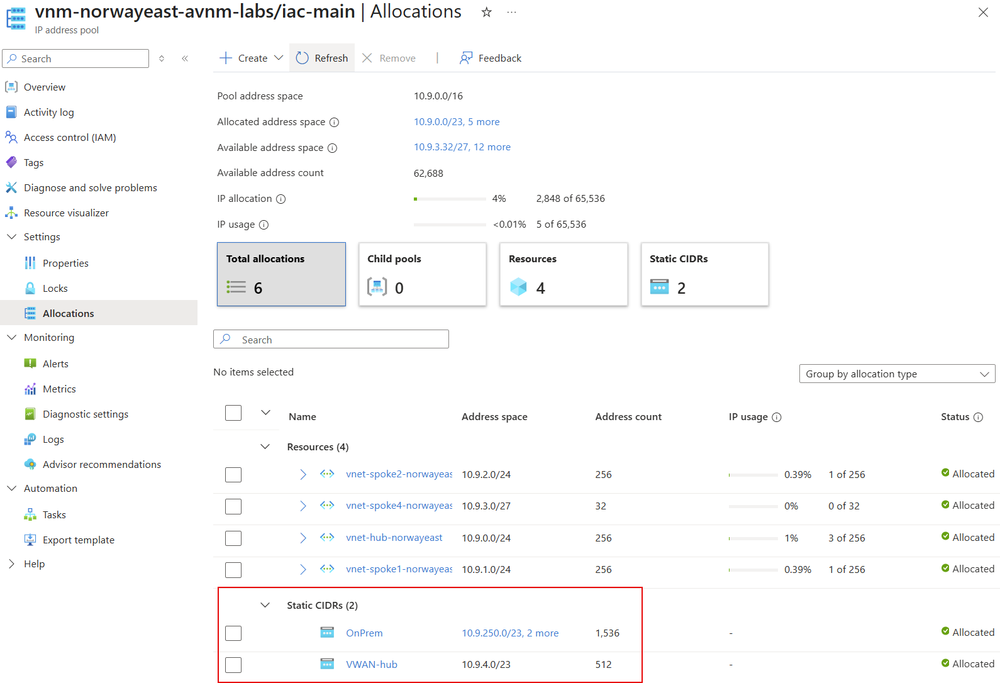
