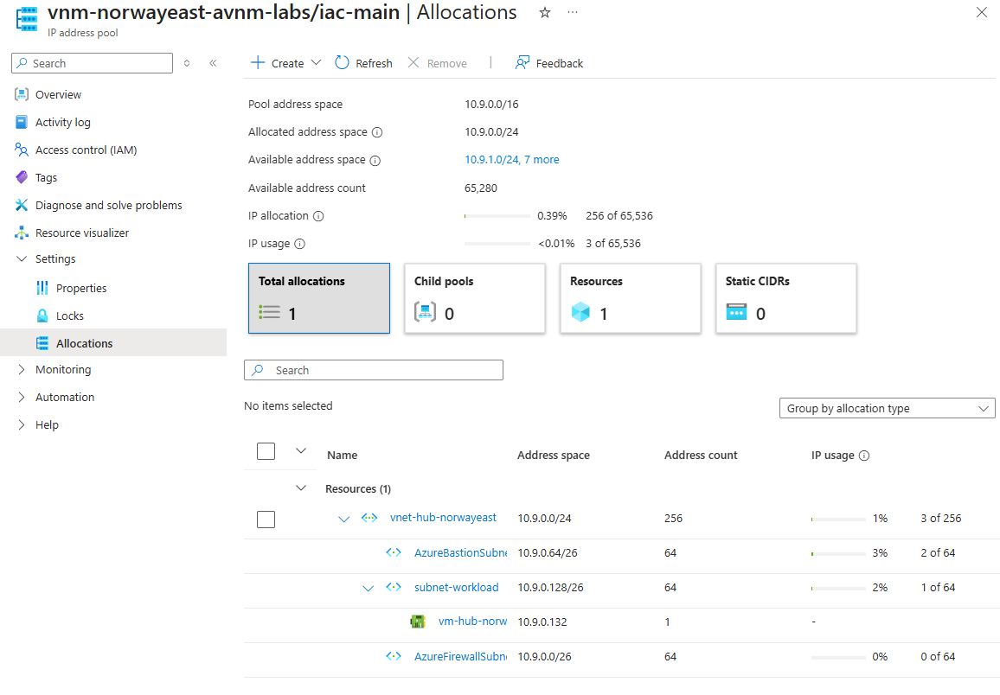

# lab-07 - Managing Virtual Networks IP addresses using AVNM IPAM

Before we start working with IP Address Management, we need to create new Address Pool in our Virtual Network Manager. This Address Pool will be used to manage IP addresses of our virtual networks.

## Task #1 - create new Address Pool    

Navigate to the `vnm-norwayeast-avnm-labs` Virtual Network Manager and select the `IP address management->IP address pools` section. Click on `Create` to create a new Address Pool.


Fill in the following information:
| Field | Value |
|-------|-------|
| Name  | iac-main-pool |
| Display name | IAC Main Pool |
| Region | Norway East |
| Description | Main Address Pool for IAC labs |
| Parent pool | Keep empty |


Click `Next` to go to `IP addresses` section.

At the `IP addresses` section, Fill in the following information:
| Field | Value |
|-------|-------|
| IP address type | IPv4 |
| Starting address | 10.9.0.0 |
| Size | /16 |


Click `Review + create` and then `Create` to create the Address Pool.

After pool is created you will see it in the list of Address Pools.


## Task #2 - Associate existing `vnet-hub-norwayeast` VNet with Address Pool using Portal

To associate `vnet-hub-norwayeast` virtual network with the IP address pool, navigate to the `vnm-norwayeast-avnm-labs/iac-main-pool` address pool and select `Allocations` under `Settings` tab. Click on `Associate resources` to associate the virtual network with the address pool.


From the list of Virtual Networks, select `vnet-hub-norwayeast` and click `Associate`.


If everything is correct, you will see the `vnet-hub-norwayeast` virtual network, all its subnets, and `vm-hub-norwayeast-nic-01` NIC associated with `vm-hub-norwayeast` virtual machine in the list of associated resources.



## Task #3 - Associate `vnet-spoke1-norwayeast` VNet with Address Pool using Bicep

You can assosiate 
To associate existing virtual network with the IP address pool using Bicep template, create `task3.bicep` file with the following content:

```bicep
param parIndex int = 1
param parLocation string = 'norwayeast'

var varVNetName = 'vnet-spoke${parIndex}-${parLocation}'

resource ipamPool  'Microsoft.Network/networkManagers/ipamPools@2024-07-01' existing = {
  name: 'vnm-${parLocation}-avnm-labs/iac-main'
}

module modVNet 'br/public:avm/res/network/virtual-network:0.7.0' = {
  name: 'deploy-${varVNetName}-${parIndex}'
  params: {
    addressPrefixes: [
      ipamPool.id
    ]
    ipamPoolNumberOfIpAddresses: '64'
    name: varVNetName
    location: parLocation
    subnets: [
      {
        name: 'subnet-workload'
        ipamPoolPrefixAllocations: [
          {
            pool: {
              id: ipamPool.id
            }
            numberOfIpAddresses: '64'
          }
        ]
      }
    ]
    enableTelemetry: false
  }
}
```

Then deploy it.

```powershell
# Make sure that you are at the folder where task3.bicep file is located
pwd

# Deploy task3.bicep file
az deployment group create -g rg-norwayeast-avnm-labs --template-file task3.bicep --parameters parIndex=1
```

## Task #4 - Associate `vnet-spoke2-norwayeast` VNet with Address Pool using `az cli`

First, make sure that `virtual-network-manager` extension is installed.

```powershell
# Install virtual-network-manager extension
az extension add -n virtual-network-manager
```

To associate existing `vnet-spoke2-norwayeast` virtual network with the address pool using `az cli`, use the following command:

```powershell
# Get iac-main IP pool resource Id
$ipamPoolId = (az network manager ipam-pool show -n iac-main --network-manager-name vnm-norwayeast-avnm-labs -g rg-norwayeast-avnm-labs --query id -o tsv)
# Associate vnet-spoke2-norwayeast with iac-main IP pool
az network vnet update --name vnet-spoke2-norwayeast -g rg-norwayeast-avnm-labs --ipam-allocations [0].number-of-ip-addresses=256 [0].id=$ipamPoolId
```

Original Address Range that was assigned to this VNet was `/24` (256 IP addresses), so we should use this value when specifying `number-of-ip-addresses` parameter.

If you check `vnm-norwayeast-avnm-labs/iac-main | Allocations` at the Portal, you should see that the `vnet-spoke2-norwayeast` virtual network is now associated with the `iac-main` IP address pool, but `subnet-workload` and `vm-spoke2-norwayeast-nic-01` NIC are not associated yet. To fix it, you need to associate subnet `subnet-workload` with IP address pool.


```powershell
# Get iac-main IP pool resource Id
$ipamPoolId = (az network manager ipam-pool show -n iac-main --network-manager-name vnm-norwayeast-avnm-labs -g rg-norwayeast-avnm-labs --query id -o tsv)

# Associate subnet-workload with iac-main IP pool
az network vnet subnet update -n subnet-workload --vnet-name vnet-spoke2-norwayeast -g rg-norwayeast-avnm-labs --ipam-allocations [0].number-of-ip-addresses=256 [0].id=$ipamPoolId
```

As with VNet, the original Address Range that was assigned to `subnet-workload` was `/24` (256 IP addresses), so we should use this value when specifying `number-of-ip-addresses` parameter.

Refresh  `vnm-norwayeast-avnm-labs/iac-main | Allocations` page and now everything should be allocated.


